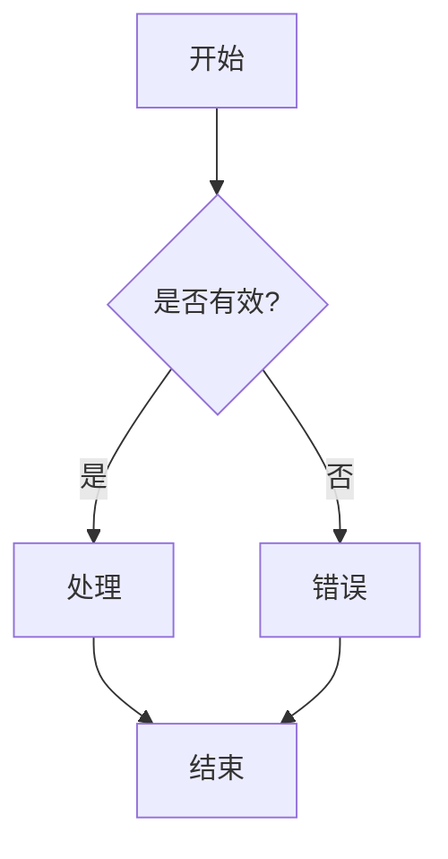
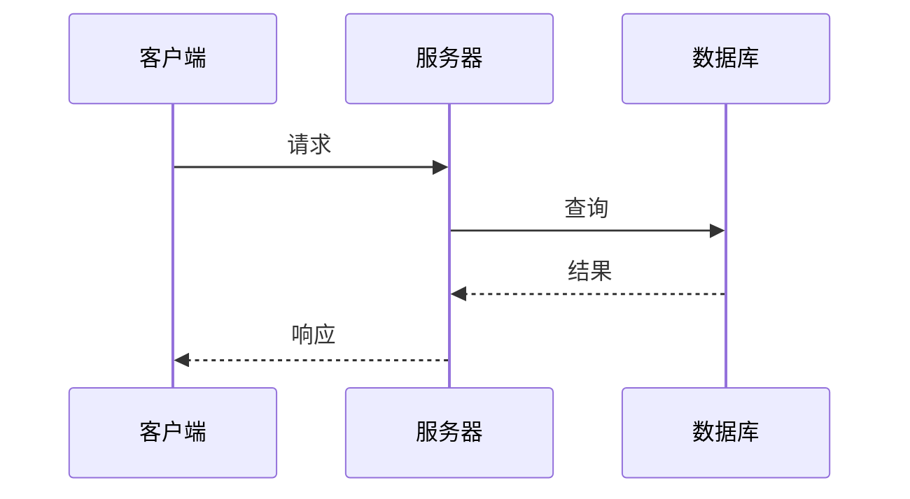
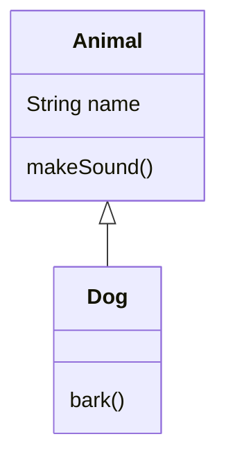
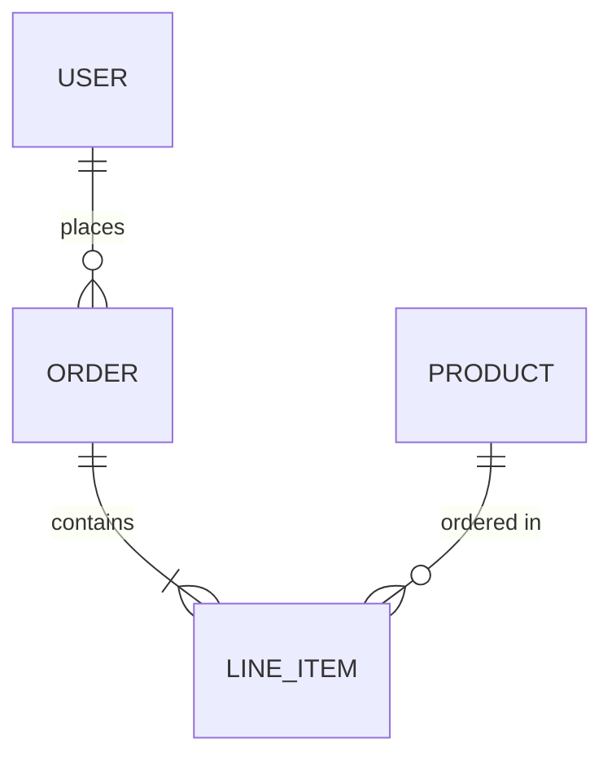

# 生成 Mermaid 图表

## 概述

分析提供的代码、架构或概念，生成清晰、结构良好的 Mermaid 图表，可视化展示关系、流程或结构。

## 说明

1. **分析输入** - 理解用户想要可视化的内容（代码流程、架构、数据关系、状态机、时序等）。

2. **选择适当的图表类型**：

    - `flowchart` - 用于流程图、决策树、算法
    - `sequenceDiagram` - 用于 API 调用、消息传递、请求/响应流程
    - `classDiagram` - 用于类结构、继承、接口
    - `erDiagram` - 用于数据库模式、实体关系
    - `stateDiagram-v2` - 用于状态机、生命周期流程
    - `graph TD/LR` - 用于依赖图、模块关系
    - `gitgraph` - 用于 git 分支策略
    - `journey` - 用于用户旅程
    - `gantt` - 用于时间线和计划

3. **生成图表**时应具备以下特点：

    - 清晰、描述性的节点标签
    - 适当使用子图进行逻辑分组
    - 一致的样式和方向
    - 边上有意义的关系标签
    - 不要过于复杂 - 如需要可拆分为多个图表

4. **输出格式**：始终将图表包装在 mermaid 代码块中：

    ```mermaid
    [图表代码]
    ```

## 图表样式指南

- 使用描述性 ID：用 `userService` 而不是 `a1`
- 当关系标签能增加清晰度时添加标签
- 使用子图对相关组件进行分组
- 保持图表可读性 - 每个图表最多约 15-20 个节点
- 使用适当的箭头样式：
- `-->` 实线箭头（主流程）
- `-.->` 虚线箭头（可选/异步）
- `==>` 粗箭头（重要路径）
- `o-->` 圆形端点（聚合）
- `*-->` 菱形端点（组合）

## 示例

### 流程图



### 时序图



### 类图



### ER 图



## 生成后

- 解释图表展示的内容
- 提供细化或扩展特定部分的选项
- 如适用，建议替代的图表类型

