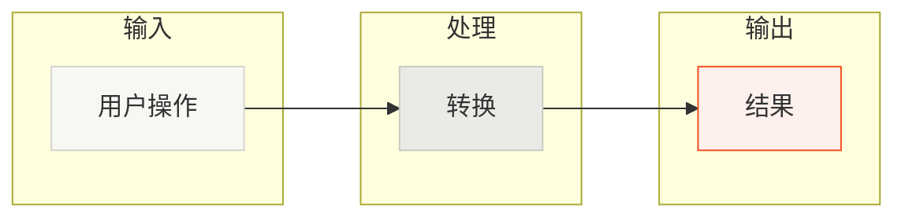
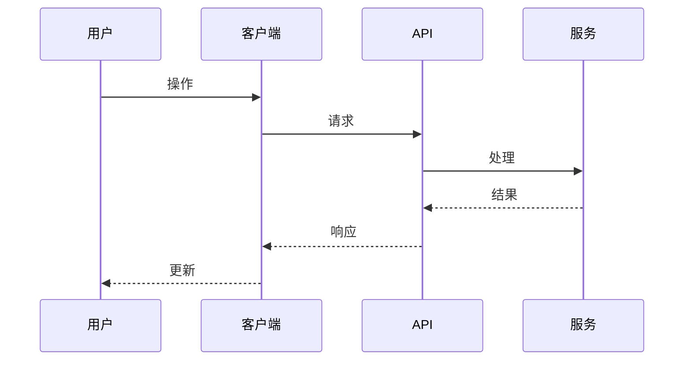

# 概览：可视化架构图

生成两个 Mermaid 图表来概览产品。使用待办事项跟踪进度。

## 待办事项列表

使用 `todo_write` 创建这些待办事项并随时更新：

1. 扫描并探索代码库结构、入口点、组件
2. 创建高层级用户旅程图
3. 创建详细技术流程的架构图

## 图表 1：用户旅程

一个任何人都能在 5 秒内理解的概览图。

- 最多 5-7 个节点，使用动作动词（"用户上传文件" 而非 "FileService"）
- 使用 `flowchart LR` 配合子图分组相关步骤
- 颜色：暖中性色（#F7F7F4），点缀橙色（#F34F1D）用于关键结果

## 图表 2：架构流程

面向开发者的技术视图，展示数据如何在系统中流动。

- 使用 `sequenceDiagram` 展示组件之间的时序流程
- 最多 4-6 个参与者，按逻辑分组
- 使用箭头展示请求/响应模式（`->>` 表示请求，`-->>` 表示响应）

## 输出

直接在聊天中渲染（不写入文件）：
1. 2 段产品描述
2. 用户旅程图
3. 架构图

## Mermaid 语法

- 子图：`subgraph ID["名称"]`
- 特殊字符需要引号：`A["@scope/pkg"]`、`K["POST /api/foo"]`
- 时序图箭头：`->>` （请求）、`-->>` （响应）、`-)` （异步）
- 参与者别名：`participant U as 用户`

