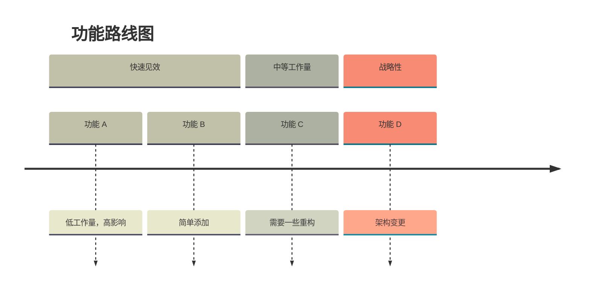
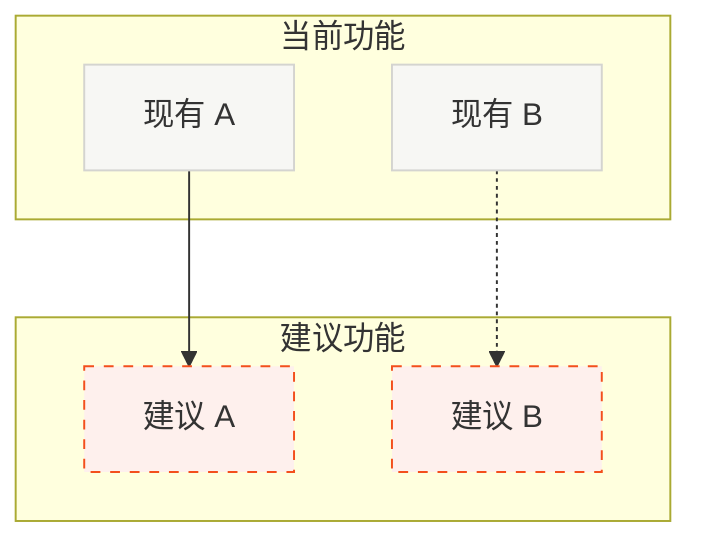

# 路线图：功能与改进建议

分析代码库并生成潜在功能和改进的可视化路线图。使用待办事项跟踪进度。

## 待办事项列表

使用 `todo_write` 创建这些待办事项并随时更新：

1. 扫描代码库架构、模式和约定
2. 识别功能缺口和改进机会
3. 创建时间线图（阶段性概览）
4. 创建当前 vs 建议流程图（集成点）
5. 询问用户要规划哪些功能

## 分析重点

在以下领域寻找机会：

- 缺失的常见模式（认证、缓存、错误处理、日志）
- 性能优化机会
- 开发者体验改进
- 面向用户的功能增强
- 代码质量/重构候选项

## 图表 1：时间线概览

按工作量级别展示功能的阶段性路线图。

- 3 个部分：快速见效、中等工作量、战略性
- 在每个阶段内分组相关功能
- 颜色：暖中性色配合主题变量

## 图表 2：当前 vs 建议流程图

现有功能和建议功能的可视化区分。

- 实线边框（#F7F7F4，#D4D4D0）：现有功能
- 虚线橙色边框（#FEF0ED，#F34F1D）：建议功能
- 实线箭头：直接依赖
- 虚线箭头：建议连接

## 输出

直接在聊天中渲染（不写入文件）：
1. 当前代码库状态的简要评估
2. 优先级功能列表（5-8 项，附带理由）
3. 时间线图（阶段性概览）
4. 当前 vs 建议流程图（集成点）
5. 询问："您希望我为这些功能中的哪些创建计划？"

## Mermaid 语法

- 时间线部分：`section 名称`
- 子图：`subgraph ID["名称"]`
- 虚线：`A -.-> B`
- 虚线边框：`stroke-dasharray:5 5`
- 特殊字符需要引号：`A["@scope/pkg"]`

