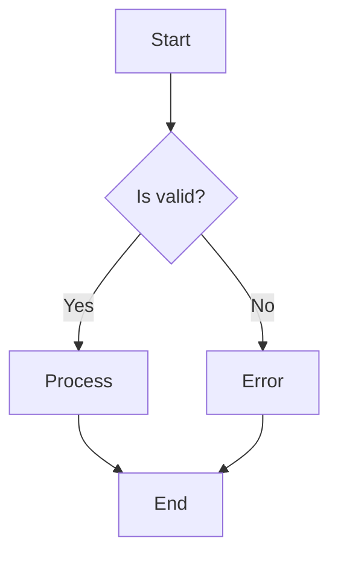
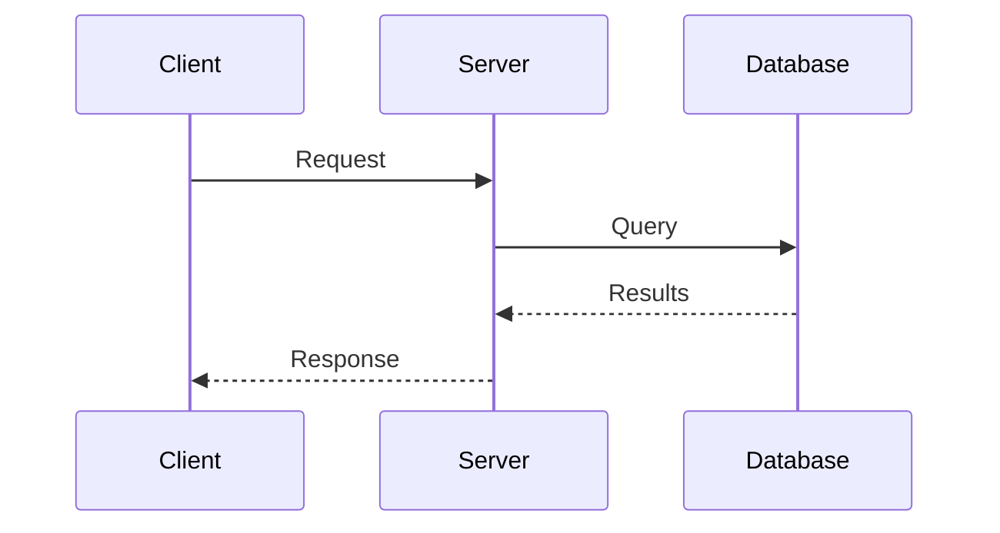
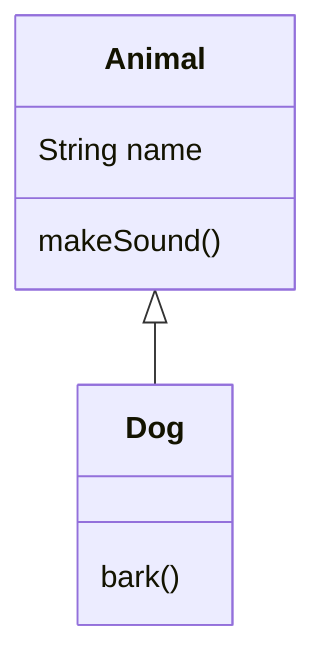
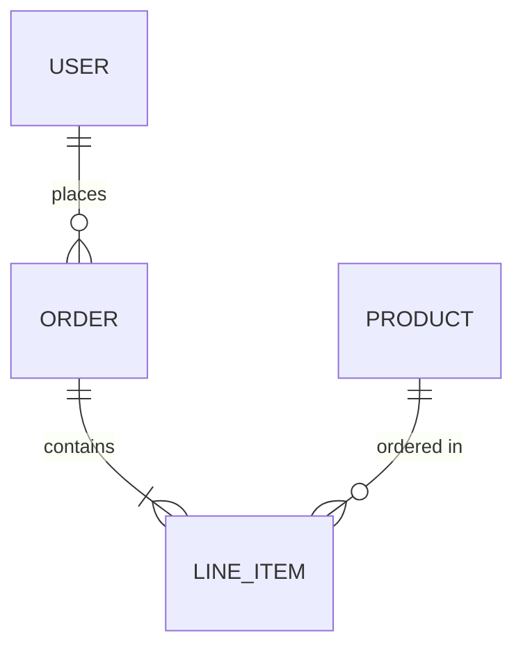

# Generate Mermaid Diagram

## Overview

Analyze the provided code, architecture, or concept and generate a clear, well-structured Mermaid diagram that visualizes the relationships, flow, or structure.

## Instructions

1. **Analyze the input** - Understand what the user wants to visualize (code flow, architecture, data relationships, state machines, sequences, etc).

2. **Choose the appropriate diagram type**:

    - `flowchart` - For process flows, decision trees, algorithms
    - `sequenceDiagram` - For API calls, message passing, request/response flows
    - `classDiagram` - For class structures, inheritance, interfaces
    - `erDiagram` - For database schemas, entity relationships
    - `stateDiagram-v2` - For state machines, lifecycle flows
    - `graph TD/LR` - For dependency graphs, module relationships
    - `gitgraph` - For git branching strategies
    - `journey` - For user journeys
    - `gantt` - For timelines and schedules

3. **Generate the diagram** with these qualities:

    - Clear, descriptive node labels
    - Logical grouping with subgraphs where appropriate
    - Consistent styling and direction
    - Meaningful relationship labels on edges
    - Not overly complex - split into multiple diagrams if needed

4. **Output format**: Always wrap the diagram in a mermaid code block:

    ```mermaid
    [diagram code here]
    ```

## Diagram Style Guidelines

- Use descriptive IDs: `userService` not `a1`
- Add labels to relationships when they add clarity
- Use subgraphs to group related components
- Keep diagrams readable - max ~15-20 nodes per diagram
- Use appropriate arrow styles:
- `-->` solid arrow (main flow)
- `-.->` dotted arrow (optional/async)
- `==>` thick arrow (important path)
- `o-->` circle end (aggregation)
- `*-->` diamond end (composition)

## Examples

### Flowchart



### Sequence Diagram



### Class Diagram



### ER Diagram



## After generating

- Explain what the diagram shows
- Offer to refine or expand specific sections
- Suggest alternative diagram types if applicable
