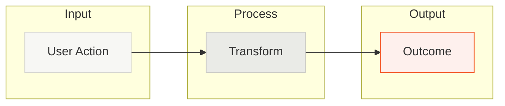
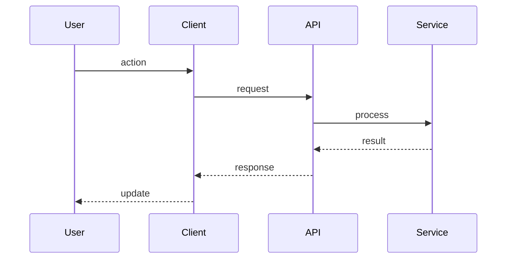

# Overview: Visual Architecture Diagram

Generate two Mermaid diagrams to overview the product. Track progress with todos.

## Todo List

Create these todos with `todo_write` and update as you go:

1. Scan and explore codebase structure, entry points, components
2. Create high-level user journey diagram
3. Create architecture diagram overviewing detailed technical flow

## Diagram 1: User Journey

A glanceable overview anyone can understand in 5 seconds.

- 5-7 nodes max, action verbs ("User uploads file" not "FileService")
- `flowchart LR` with subgraphs to group related steps
- Colors: warm neutrals (#F7F7F4), accent orange (#F34F1D) sparingly for key outcomes

## Diagram 2: Architecture Flow

Technical view for developers showing how data flows through the system.

- Use `sequenceDiagram` to show temporal flow between components
- 4-6 participants max, grouped logically
- Show request/response patterns with arrows (`->>` for requests, `-->>` for responses)

## Output

Render directly in chat (don't write files):
1. 2-paragraph product description
2. User journey diagram
3. Architecture diagram

## Mermaid Syntax

- Subgraphs: `subgraph ID["Name"]`
- Special chars need quotes: `A["@scope/pkg"]`, `K["POST /api/foo"]`
- Sequence arrows: `->>` (request), `-->>` (response), `-)` (async)
- Participant aliases: `participant U as User`
